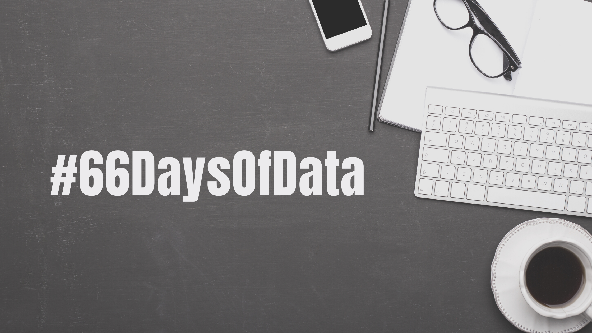

This page contains my daily bit of data science learning for [#66DaysofData](https://twitter.com/hashtag/66DaysofData?src=hashtag_click) from January 5th, 2021.

## Day 1 - 5th January, 2021

1. Read all articles in the [#DataDecember Initiative](https://dsatlse.github.io/DataDecember/)
2. Completed Module 1 of [BCG Open-Access Data Science & Advanced Analytics Virtual Experience Program]([Learn from top companies and set yourself apart (theforage.com)](https://www.theforage.com/virtual-internships/Tcz8gTtprzAS4xSoK?show-onboard=1))
   - Designed a data science problem based on a given hypothesis

---

## Day 2 - 6th January, 2021

1. Binged through Ken Jee's Sports Analytics videos and content
   - [The 4 Types of Sports Analytics Projects - YouTube](https://www.youtube.com/watch?v=dlZWB2D-NaQ)
   - [How YOU Can Land a Sports Analytics Job - YouTube](https://www.youtube.com/watch?v=SLC5sPZSLY4)
   - Official Website: [Playing Numbers - Sports Analytics Content for those Interested in Playing the Numbers](https://www.playingnumbers.com/)
   - Conferences and Blogs
     - [MIT Sloan Sports Analytics Conference - Sports Analytics, Business, & Technology. (sloansportsconference.com)](https://www.sloansportsconference.com/)
     - [The Harvard Sports Analysis Collective - The official blog of the Harvard Sports Analysis Collective](http://harvardsportsanalysis.org/)
   - Ken Jee's Tips to get a job in Sports Analytics
     - Read atleast 2-3 articles per day
     - Learn skills and tools
     - Engage with community
     - Work for university teams
     - Do projects
     - Produce content
     - Reach out
2. Scraped a website on bribes paid in India using the rvest package in R (Site: [http://ipaidabribe.com](https://t.co/4dIEdh1aXJ?amp=1)) and collected 1000 instances of such bribes in the last year
   - 1000 is too low. However, I don't have time currently with my assignments to run the system for longer to collect more data
   - Potential project : Analyze bribes in India
     - Which department takes most bribe?
     - Which state collects most?
     - What is the sentiment of people writing the posts?
     - Bonus: Is the initiative by this website being used correctly?

---

## Day 3 - 7th January, 2021

1. Worked with the [rtweet](https://github.com/ropensci/rtweet) package to collect tweets from twitter
   - Used this to work on my winter assessment
   - Resource used: [https://mkearney.github.io/nicar_tworkshop](https://t.co/rMF3dLunzL?amp=1)

---

## Day 4 - 8th January, 2021

1. Had a perfunctory read over the winning solutions to the [Hateful Memes Challenge hosted on DrivenData](https://www.drivendata.co/blog/hateful-memes-winners/)
2. Listed out **potential projects** that I can work on during the next few weeks as a part of #66DaysofData
   - Why?
     - It would be useless to do #66DaysofData if I don't put it to practical use
     - Will help me improve my portfolio
   - What types of projects?
     - The plan is to work on projects that involve at least one of the following concepts
       - Intensive data cleaning
       - Storytelling with data
       - Predictive analytics - Tabular data
       - Natural Language Processing
       - Computer Vision
       - SQL
       - End-to-end deployment or Building an ML system

---

## Day 5 - 9th January, 2021

1. Brushed up SQL Basics
   - [SQL Cheatsheet](https://www.codecademy.com/learn/learn-sql/modules/learn-sql-queries/cheatsheet)
   - [SQL Order of Operations](https://learnsql.com/blog/sql-order-of-operations/)
   - What project can I do to ensure I understand SQL better?
     - A web app that uses SQL? (But, I don't like web development much)
     - A Python - SQL application? (I do not know what this means, **should read more**)
   - What hands on experience do I have already?
     - MY470 lectures at my MSc

---

## Day 6 - 10th January, 2021

1. Followed through on my SQL journey from yesterday with some hands on usage of the [RSQLite](https://cran.r-project.org/web/packages/RSQLite/vignettes/RSQLite.html) package
   - But, the question now is how can I use this new R + SQL skill to make something useful?
2. Also, watched [The most powerful idea in data science - YouTube](https://www.youtube.com/watch?v=e9KJ3kd80fQ) by Cassie Kozyrkov

---

## Day 7 - 11th January, 2021

1. Performed and compared sentiment analysis outputs with the tidytext package in R and the sentimentr package
   - [https://www.tidytextmining.com/tidytext.html](https://www.tidytextmining.com/tidytext.html)
   - [trinker/sentimentr: Dictionary based sentiment analysis that considers valence shifters (github.com)](https://github.com/trinker/sentimentr)
2. Put some thought into using R + SQL for a project - Fixed on creating a dummy ETL system

   - Main idea : Create a basic web app that can be used by the animal shelter where I interned
   - Data : Create dummy data based on the original data the shelter collects
     - Store in excel sheets as that's what the shelter does
   - Write a web app in R that can load the dataset directly and deliver some visualizations
   - Convert the results of the app into a PDF report and save it
     - Can be used to quickly generate monthly reports
     - Also give an option for the user to enter some other manual text or pointers into the report
   - Resources
     - [Chapter 9 Interfacing with databases in R - Data Science with R: A Resource Compendium (bookdown.org)](https://bookdown.org/martin_monkman/DataScienceResources_book/interfacing-with-databases-in-r.html)
     - [Extract, transform, load - Wikipedia](https://en.wikipedia.org/wiki/Extract,_transform,_load)
     - [Web Apps in R: Building your First Web Application in R - Shiny Tutorial Ep 1 - YouTube](https://www.youtube.com/watch?v=tfN10IUX9Lo)

---

## Day 8 - 12th January, 2021

1. Spent time going over my dissertation proposal and the data I will need to collect to make it happen

   - What data do I need?
     - Qualitative?
     - Quantitative?
   - How will I collect the data?
     - Use secondary resources?
     - Collect it first hand?
       - With human interaction?
       - Without human interaction?
   - How will I store the data?
     - Local system?
     - Cloud?
     - Documentation?
   - What ethical considerations must I be aware of?

   ---

   