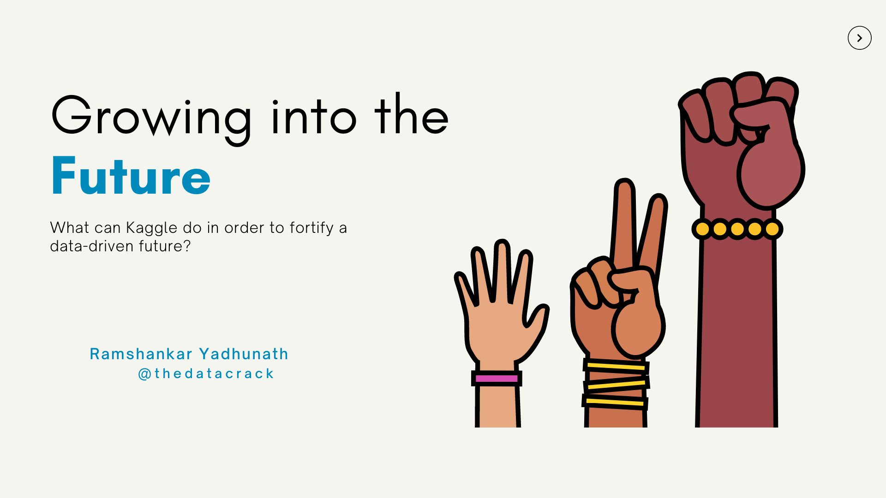
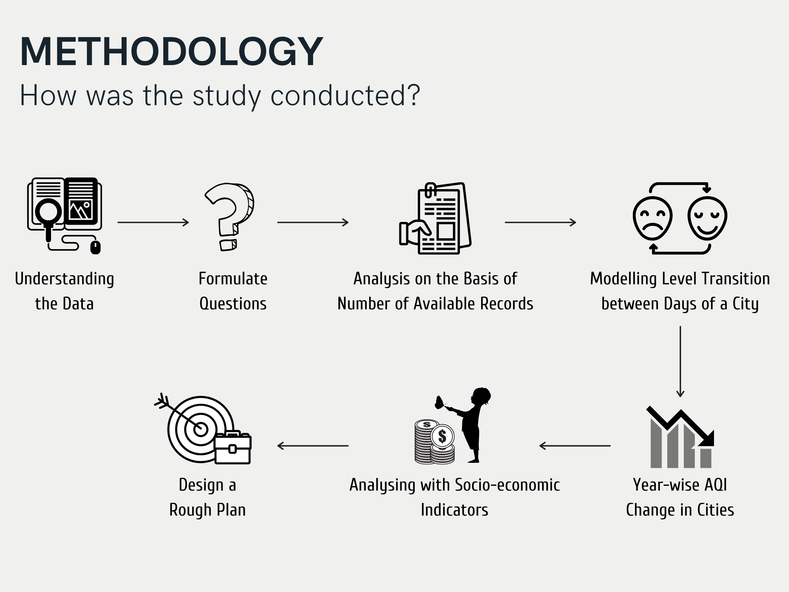
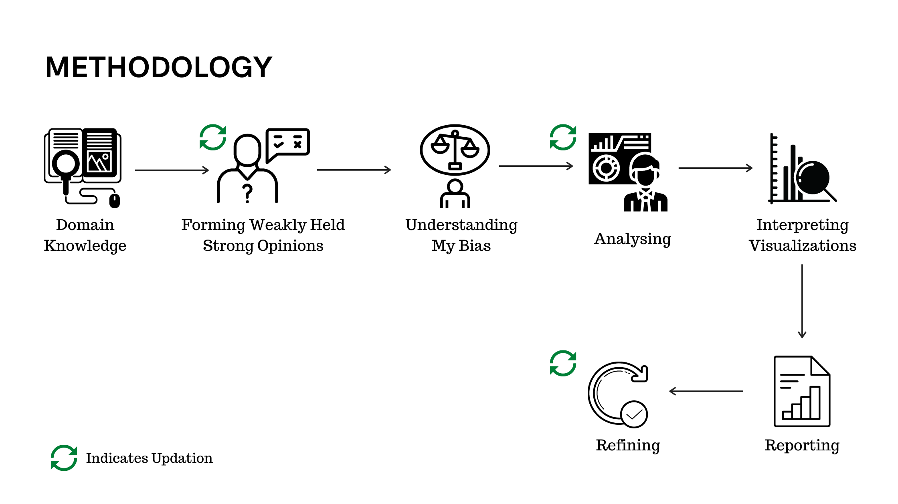
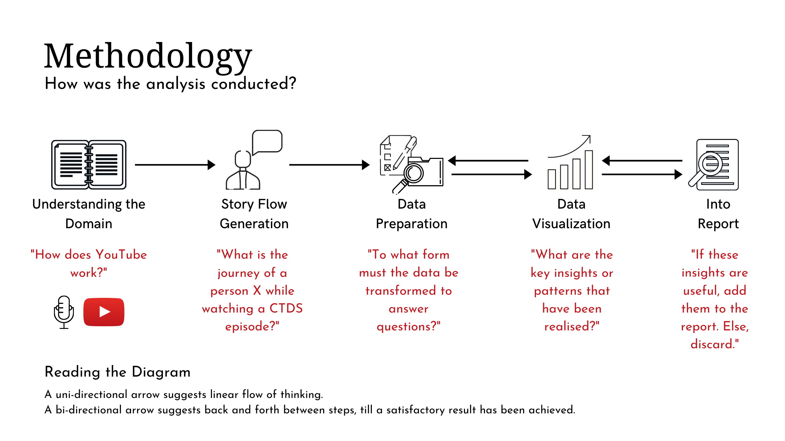
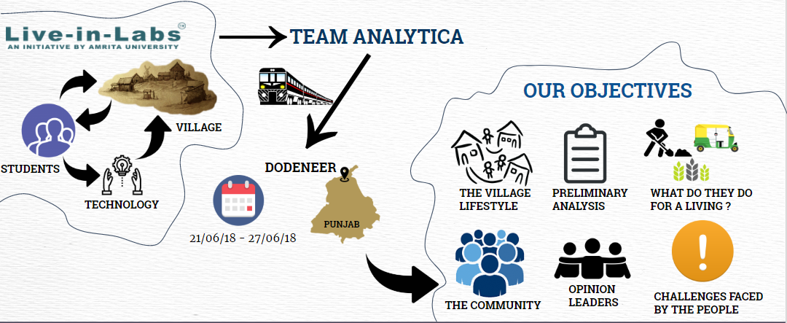
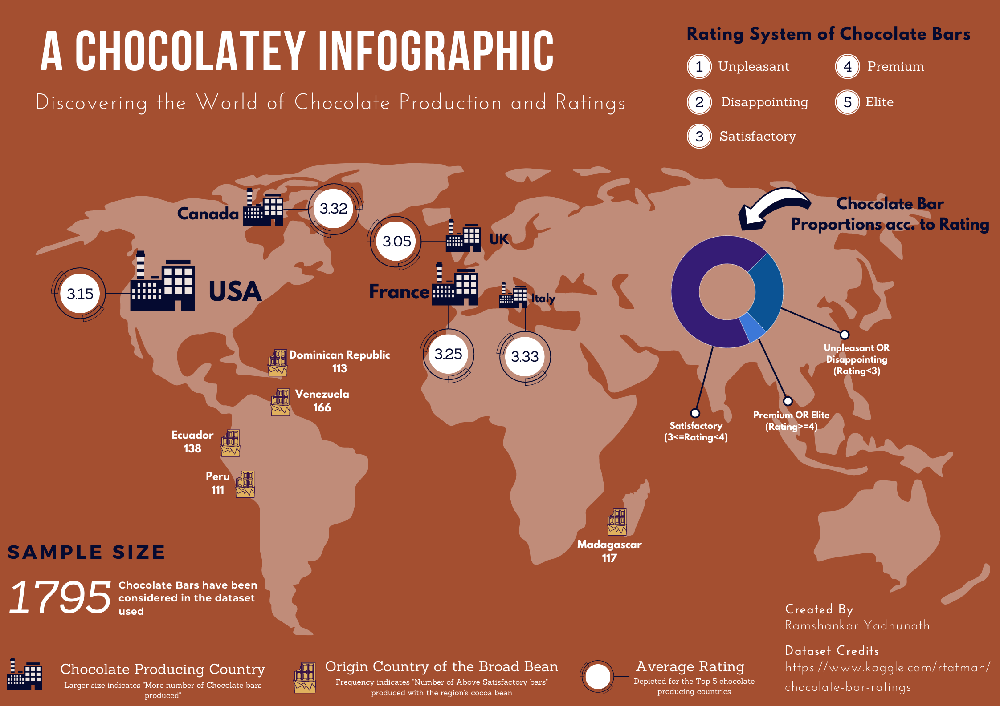

This page contains details about projects that I have worked on. If you would like to know about any project in particular, I would love to engage in a conversation.

---

## Analyzing Kaggle DS and ML Survey 2020

> An analysis of the survey focused on Indian respondents who were under the age of 21 years

**The Project Overview :** 
In this project, I present an attempt to explore the Kaggle survey responses of **young data science aspirants from India** and to understand their current state in data science by dissecting my finds across multiple themes.

**The Links to the Project :** 

- [Kaggle Notebook](https://www.kaggle.com/thedatabeast/the-rise-of-data-science-interest-in-india)
- [Presentation Deck](https://www.canva.com/design/DAEQe2bfn-8/view?utm_content=DAEQe2bfn-8&utm_campaign=designshare&utm_medium=link&utm_source=publishsharelink)

**Keywords :** Data analysis, Data storytelling, Tabular data, Python

---

## Making every bit count - Where to invest to combat air pollution in India?

> Identifying the cities that require immediate attention to their increasing air pollution

**The Project Overview :** 
This project involves a study on India's growing unrest with respect to air quality issues. It takes into account quantitative data depicting AQI levels in differnet cities across the country and makes a suggestion as to which cities most require external investment to improve the quality of air and thus, reduce the detrimental effects on the population.

**The Links to the Project :** 
- [Kaggle Notebook](https://www.kaggle.com/thedatabeast/where-to-invest-to-combat-air-pollution-in-india)
- [Presentation Deck](https://www.canva.com/design/DAEHX8BoyPA/view?utm_content=DAEHX8BoyPA&utm_campaign=designshare&utm_medium=link&utm_source=publishsharelink)

**Keywords :** Data Analysis, Data storytelling, Time series data, Python, Data for Good

---

## Understanding the Extent of Police Abuse in the United States of America
> Reviewing both sides of the coin with the help of publicly available data

**The Project Overview :**
Policing is no-doubt a difficult job. But, its also something that provides **too much power into the hands of a few individuals**. In such a social setup, it becomes difficult to hold people with authority accountable for their actions. The issue of racial bias in the policing system in US has been discussed widely and largely across nations. However, most views are single-dimensional. In this project, I make an attempt to provide different perspectives of the problem.   

**The Links to the Project :** 
- [Kaggle Notebook](https://www.kaggle.com/thedatabeast/understanding-the-extent-of-police-abuse-in-the-us)
- [Methodology Explanation](https://ry05.github.io/2020-08-30-us-police-abuse/)

**Keywords :**  Data analysis, Data storytelling, Data for Good, Python, Tabular data

---

## Amplifying the Impact of the CTDS Shows on YouTube
> Dissecting the "success" of the podcast's YouTube episodes and towards formulating a strategy to reach a wider audience

**The Project Overview :**
This project is my official submission to the [CTDS.show contest](https://www.kaggle.com/rohanrao/chai-time-data-science/discussion/156137) held on Kaggle. The task was to unearth insights and tell an interesting/actionable story with the dataset of the [Chai Time Data Science podcasts](https://chaitimedatascience.com/). I won the contest and more details on my experience on this contest has been described in [this blog post](https://ry05.github.io/2020-07-25-making-perfect-chai/).  

**The Links to the Project :** 
The following links provide further details on my work in this project.  

- [Official Submission to the Contest](https://www.kaggle.com/thedatabeast/making-perfect-chai-and-other-tales)
- [Winner's Interview on the CTDS podcast](https://www.youtube.com/watch?v=6RrZyQoG1lY)

**Keywords :**  Data analysis, Data storytelling, Text data, Python, Tabular data, Youtube analytics

---

## CouReco - Simple Course Recommendation System for Online Courses

**The Project Overview :**
CouReco is a minimalistic system built on the idea to help learners navigate through the courses on Coursera, aided by a data-driven strategy. Currently, CouReco only performs the task of identifying the most similar and most dissimilar courses to a selected course that is chosen by the learner from a pool of courses relevant to the skills the learner is interested in.

**The Links to the Project :**
The project's detailed code and related documentation can be found here

- [Github Repository](https://github.com/ry05/couReco)

**Keywords :**  Web scraping, Data analysis, Recommender systems, Product building, Python, Streamlit

---

## Leveraging Data for Social Good — A Practical Example

**The Project Overview :**
Studied the needs of a rural, backward and socially-isolated village in Northern India in the context of their developmental goals and social aspirations. Established that "Water stress" arising from poor water management practices was a significant hindrance to the village's development. A human-centered methodology was followed to collect both qualitative as well as quantitative data and the analysis was performed using both computational techniques as well as qualitative methods. The findings were informed to the stakeholders as well as relevant policy-makers.

**The Links to the Project :**
I have already covered this project in detail via an article in Medium and the code is available on my Github account. So, I shall leave those links out here in case you wish to know more.

- [Medium Article](http://bit.ly/village-data-analysis)
- [Github Repository](https://github.com/ry05/Live-in-Labs-Analysis)

**Keywords :**  Data for Good, Data analysis, Data collection, Python, Ethnographic study

---

## Criminal Activity Hotspot Analysis

**The Project Overview :**
The project finds relevance in analysing the prevelance of areas of high crime rates(called hotspots) in cities. Through our work, we have gone a little deeper than conventional studies of criminal activity hotspots and have established a relation that ***If crime can vary across months, across days in the week and even across hours of the very same day; it is definitely a fact that the rate of crime will not remain constant across districts within a city at any point of time. Some may face greater vulnerabilities to criminal activity than others.*** Based on this idea, we put together a predictive modelling study that helped create a model that would be able to predict the relative susceptibilities of districts in a city based on past crime records in these regions at given time points(a time point is made up of hour, day and month).  

Our final work also took shape as a conference paper at CSITSS 2019 held at RVCE, Bengaluru, Karnataka, India. This paper won the "Best Paper" award at the same conference.

**The Links to the Project :**
The project's detailed code and related documentation can be found here

- [Github Repository](https://github.com/ry05/Criminal-Activity-Hotspots)

**Keywords :** Supervised machine learning, Time series data, Python

---

## Analyzing Chocolate Bar Ratings

**The Project Overview :**
Exploratory Data Analysis(EDA) is one of the most crucial steps in a Data Science project. EDA in basic terms is a way of "Understanding the data with the help of visualizations and descriptive statistics". A lot of courses I signed up for in the past emphasised on the need to use EDA to understand datasets and use this information to either model a ML/DL problem or tell a convincing story about the dataset to a stakeholder.
Therefore, through this project I made an attempt at improving my EDA skills using the Chocolate Bar Ratings Dataset.

**The Links to the Project :**
The project's detailed code and related documentation can be found here

- [Github Repository](https://github.com/ry05/Chocolate-Bar-Analysis)

**Keywords :** Data analysis, Data storytelling, Tabular data, Python

